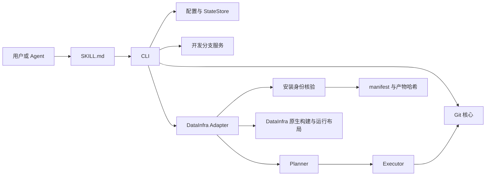
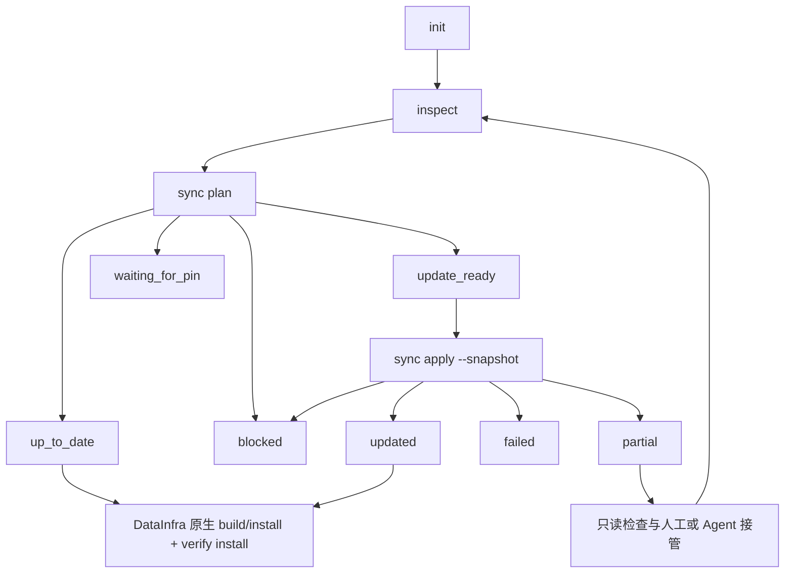

# data-infra-sync-skill 设计与能力

本文档描述 `data-infra-sync-skill` 当前版本的设计目标、系统边界、结构化协议、已实现能力和运行限制。README 提供安装与快速开始，`references/` 提供具体操作步骤，本文档集中说明各部分如何组成完整系统。

## 1. 目标

`data-infra-sync-skill` 面向已有 DataInfra 组合仓的开发者、coding agent 和受控调度任务，提供同一套本地版本检查与同步协议。

系统完成以下工作：

- 读取父仓和一级 submodule 的实际 Git 状态。
- 将公共跟踪分支解析为一个父仓提交及其精确 gitlink 集合。
- 在安全前置条件成立时同步到目标组合。
- 管理子仓开发分支的创建、恢复和发布覆盖检查。
- 处理 DataInfra 当前声明的单个受控 Delta 构建补丁。
- 核验源码、构建副本、安装副本和运行进程映射的一致性。
- 通过版本化 Result 将决定、原因和下一步交给用户或 agent。

完成标准是：常见状态由确定性 CLI 给出唯一安全动作；低频异常保留现场，并提供足够的结构化信息供用户或 agent 接管。

## 2. 能力状态

| 能力 | 当前状态 | 执行边界 |
|---|---|---|
| checkout 初始化与独立配置 | 已实现 | 要求仓库已经存在且可用 |
| 父仓和一级 submodule 状态检查 | 已实现 | 使用逻辑路径输出，不修改 Git 现场 |
| offline 同步计划 | 已实现 | 只使用本地对象和已获取 ref |
| fresh 同步计划 | 已实现 | 获取公共目标和目标对象，不修改本地分支或工作树 |
| snapshot 受控同步 | 已实现 | 复检全部前置事实后执行 |
| 无人值守单次同步 | 已实现 | 仅供明确配置的调度任务使用 |
| 开发分支状态、创建、恢复和发布检查 | 已实现 | 不负责 commit、push、合并或删除分支 |
| 单个连续受控补丁重放 | 已实现 | 补丁声明和实际状态必须唯一且连续 |
| 多补丁和补丁迁移处理 | 显式停止 | 返回结构化 transition，由用户或 agent 处理 |
| DataInfra 构建与测试 | 使用仓库原生能力 | 本项目提供调用指导，不复制构建实现 |
| 安装 manifest 与 `.so` 一致性核验 | 已实现 | 覆盖构建、安装副本和关联 `gaussdb` 映射 |
| 写后失败自动恢复 | 人工或 Agent 接管 | 返回 `partial`，不保存跨进程执行阶段 |
| Agent Skill 安装 | 已实现 | 支持 Codex、Claude Code 和 Gemini CLI 的标准 Skill 目录 |
| QCC paired A/B 评估 | 协议与汇总器已实现 | campaign 会话和临时 checkout 由执行者编排 |

## 3. 领域术语

**组合仓**

通过父仓 gitlink 固定多个 submodule 精确版本的 Git 仓库集合。

**目标组合**

目标 remote/branch 当前指向的父仓提交，以及该提交树中记录的全部一级 submodule pin。

**组合仓安全同步**

在保留可解释开发现场的条件下，将本地父仓和一级 submodule 收敛到目标组合的受控过程。

**覆盖关系**

当前 HEAD 相对目标 pin 的关系。`equal` 表示相同提交，`contained` 表示目标包含当前提交，`tree_equal` 表示提交不同但 tree 相同，`diverged` 表示无法安全离开当前 HEAD。

**开发分支**

子仓中保存开发提交的本地命名引用。组合 pin 通常以 detached HEAD 形式检出，开发分支引用继续保留。

**受控构建补丁**

由父仓版本化保存、指向固定 submodule 和适用路径，并由 DataInfra 构建流程使用的补丁。

**补丁连续性**

当前父仓与目标父仓声明相同的补丁名称、字节哈希、目标 submodule 和适用路径。连续状态允许同步流程暂时反向移除补丁并在目标 pin 上重放。

**安装身份**

父仓和一级 submodule HEAD、受核验产物相对路径及 SHA-256 的集合。

**Result**

CLI 对一次命令的完整结构化结果，包含状态、原因、目标、仓库事实、变更标志、下一步、snapshot 和目标新鲜度。

**部分同步状态**

命令已经尝试修改工作树或本地引用，随后未能证明目标状态完整达成。CLI 使用 `partial` 和退出码 4 明确报告该状态。

## 4. 架构



系统采用“通用 Git 核心 + 纯 Planner + 受控 Executor + DataInfra Adapter + Agent Skill”结构。

| 组件 | 位置 | 职责 |
|---|---|---|
| CLI | `src/data_infra_sync/cli.py` | 参数解析、路由、Result 输出、退出码和审计边界 |
| Git 核心 | `src/data_infra_sync/git.py` | Git argv 执行、仓库事实、gitlink 和提交关系 |
| Planner | `src/data_infra_sync/planner.py` | 根据不可变事实计算状态、原因、Action 和 snapshot |
| Executor | `src/data_infra_sync/executor.py` | fresh 复检、单补丁同步、领域写入和后置校验 |
| 分支服务 | `src/data_infra_sync/branches.py` | 开发分支检查、创建、恢复和发布覆盖检查 |
| DataInfra Adapter | `src/data_infra_sync/adapters/datainfra.py` | 目标获取、submodule 布局、运行实例、补丁和产物规则 |
| 安装核验 | `src/data_infra_sync/verify.py` | 安装身份、产物组和进程映射一致性 |
| 配置与状态 | `config.py`、`state.py` | 工作区配置、锁、审计、manifest、原子写入和脱敏 |
| Result schema | `schemas/result-v1.schema.json` | Result v1 的字段、枚举和嵌套对象约束 |
| Agent Skill | `SKILL.md` | 使用入口、状态机动作和安全停点 |
| QCC evaluator | `evals/` | paired A/B 场景目录、记录校验和描述性汇总 |

通用核心处理 Git 关系和同步状态。DataInfra Adapter 提供项目特有事实，不将本机路径、构建环境或项目例外写入通用状态计算。

## 5. 运行流程



常见交互流程如下：

1. `init` 验证 checkout 根目录并写入独立配置。
2. `inspect` 使用本地对象生成当前状态。
3. `sync plan` fresh 获取目标并生成执行 snapshot。
4. stale `update_ready` 先执行 fresh `sync plan` Action；fresh `update_ready` 再执行 snapshot apply Action。
5. `updated` 或 `up_to_date` 后调用 DataInfra 原生构建与安装流程。
6. `verify install --record` 记录安装身份，普通 `verify install` 再确认一致性。
7. `blocked`、`waiting_for_pin`、`failed` 和 `partial` 停止自动变更并报告原因。

## 6. 命令与副作用

| 命令 | 工作树或本地 ref | 远程 ref 或对象库 | 配置或状态 | 网络 |
|---|---:|---:|---:|---:|
| `init` | 无 | 无 | 写 | 无 |
| `inspect` | 无 | 无 | 写审计 | 无 |
| `branch status` | 无 | 无 | 写审计 | 无 |
| `branch start` | 写 | 无 | 写审计 | 无 |
| `branch resume` | 写 | 无 | 写审计 | 无 |
| `branch publish-check` | 无 | 写 tracking ref 和对象 | 写审计 | 有 |
| `sync plan --offline` | 无 | 无 | 写审计 | 无 |
| `sync plan` | 无 | 写 tracking ref 和对象 | 写审计 | 有 |
| `sync apply --snapshot <hash>` | 写 | 写 tracking ref 和对象 | 写审计 | 有 |
| `sync apply --non-interactive` | 写 | 写 tracking ref 和对象 | 写审计 | 有 |
| `verify install` | 无 | 无 | 读 manifest、写审计 | 无 |
| `verify install --record` | 无 | 无 | 写 manifest 和审计 | 无 |

所有命令在同一工作区状态目录上获取非阻塞进程锁。锁冲突显式失败，不等待另一个写流程完成。

`sync apply` 的两种模式严格互斥：

- `--snapshot <hash>` 使用调用方持有的 64 位 SHA-256，fresh 复检后要求完全相同。
- `--non-interactive` 在同一进程和锁内完成计划、复检与执行，供明确配置的调度任务使用。

## 7. Result v1 与状态机

Result 固定包含以下顶层字段：

| 字段 | 含义 |
|---|---|
| `schema_version` | 固定为 `"1"` |
| `command` | 产生结果的逻辑命令 |
| `state` | 当前命令的状态枚举 |
| `reason_codes` | 稳定、可排序的原因码 |
| `target` | 目标父仓、remote、branch 和 gitlinks，或 `null` |
| `repositories` | 父仓和子仓的逻辑路径、HEAD、目标和工作树事实 |
| `changed` | 本次命令是否确认产生领域变更 |
| `next_actions` | 结构化 Action 数组 |
| `snapshot` | 计划前置事实的 SHA-256，或 `null` |
| `stale_target` | 是否只使用本地目标事实 |

Action 固定包含 `kind`、`argv`、`mutates_worktree`、`requires_confirmation` 和 `preconditions`。Agent 将 `argv` 作为参数数组执行，不经过 shell 拼接。

主要状态分组如下：

| 分组 | 状态 |
|---|---|
| 配置与检查 | `unconfigured`、`initialized`、`inspected` |
| 同步 | `up_to_date`、`update_ready`、`updated`、`waiting_for_pin`、`blocked` |
| 分支 | `branch_status`、`branch_started`、`branch_resumed`、`publish_required`、`publish_verified` |
| 部署 | `unknown`、`build_required`、`deployment_consistent`、`deployment_mismatch` |
| 错误 | `failed`、`partial` |

退出码定义：

| 退出码 | 含义 |
|---:|---|
| 0 | 检查完成、目标已达成或操作完成；结合 `state` 判断语义 |
| 2 | 配置缺失、等待目标、显式阻塞、发布/构建/部署需要处理 |
| 3 | 配置、网络、Git、I/O 或内部失败，未确认产生领域写入 |
| 4 | 已尝试领域写入后失败，进入 `partial` 接管 |

审计状态写入不属于领域写入。审计或渲染在领域写入后失败时，CLI 保留 `partial` 语义，防止已修改现场被报告为普通失败。

## 8. 计划与同步算法

### 8.1 事实收集

DataInfra Adapter 收集以下事实：

- 当前父仓 HEAD、分支、工作树、index 和活动 Git 操作。
- 目标 remote/branch 的父仓提交。
- 当前父仓和目标父仓的一级 submodule 名称、路径、URL 和 pin。
- 每个子仓的 HEAD、分支、upstream、ahead/behind 和工作树状态。
- 当前 HEAD 相对目标 pin 的覆盖关系。
- DataInfra 工作区关联的运行中 `gaussdb`。
- 当前与目标父仓的受控补丁声明及实际补丁状态。

fresh 模式使用明确 ref、空 refmap 和关闭递归 submodule fetch 的 Git argv 获取对象，避免继承 remote refspec 改写本地分支。offline 模式只读取本地对象和 ref，并设置 `stale_target=true`。

### 8.2 Planner

Planner 是纯函数。它按固定安全优先级输出状态和原因：

- 父仓目标缺失或子仓目标对象缺失：`waiting_for_pin`。
- 父仓分支不匹配、无法 fast-forward、普通 dirty、活动 Git 操作、运行实例、嵌套 submodule、布局迁移或补丁迁移：`blocked`。
- 子仓当前 HEAD 未被目标 pin 覆盖：`waiting_for_pin`。
- 父仓和全部目标 submodule 已精确到位：`up_to_date`。
- 其他安全状态：`update_ready`。stale 事实生成 fresh `sync plan` Action，fresh 事实生成 snapshot apply Action。

新增 submodule 可以初始化。已有 submodule 的删除、改名、路径变化、URL 变化，以及名称复用到新路径，均归类为布局迁移并停止。

### 8.3 Snapshot

snapshot 对规范化 JSON 计算 SHA-256。输入包含：

- 目标父仓、gitlinks 和 submodule 声明。
- 父仓当前 HEAD、分支、index、工作树和活动操作。
- 每个子仓的 HEAD、工作树、分支关系和目标 pin。
- 受控补丁状态、运行实例和布局限制。

snapshot 不包含时间戳、输出格式和本机绝对路径。fresh 复检得到不同 snapshot 时，Executor 返回 `snapshot_mismatch`，不执行领域写入。

### 8.4 Executor

Executor 在首次写入前完成 fresh 计划、snapshot、补丁声明和目标适用性复检。写入顺序固定为：

1. 反向移除当前连续受控补丁。
2. 使用 `git merge --ff-only` 更新父仓。
3. 初始化新增 submodule，或将现有 submodule detached checkout 到精确目标 pin。
4. 在目标 pin 上重放受控补丁。
5. 重新收集事实并要求计划达到 `up_to_date`。

前置检查失败返回 `blocked` 或 `failed`。任何写入尝试后的异常或后置条件失败返回 `partial`，并尽力重新读取实际 HEAD、分支和工作树。

## 9. 开发分支能力

分支命令只接受 Result 中的逻辑仓库路径。

### `branch status`

报告本地分支、upstream、ahead/behind 和目标 pin 关系。目标对象尚未获取时返回 `waiting_for_pin`。

### `branch start`

从目标 pin 创建并切换到全新本地分支。命令要求：

- 目标 pin 已存在。
- 当前工作树 clean。
- 没有活动 Git 操作。
- 当前 HEAD 为 `equal`、`contained` 或 `tree_equal`。
- 分支名通过 Git 原生规则，且本地分支尚不存在。

### `branch resume`

切换到明确存在的本地分支，使用与 `branch start` 相同的离开当前 HEAD 前置条件。已经位于目标分支时命令幂等完成。

### `branch publish-check`

安全获取当前分支配置的远程 upstream，随后判断：

- upstream 尚未包含当前 HEAD：`publish_required`。
- upstream 已包含当前 HEAD，但公共目标 pin 尚未覆盖：`waiting_for_pin`。
- 目标 pin 以提交包含或 tree 等价覆盖当前 HEAD：`publish_verified`。

upstream 只用于发布状态检查。普通同步不会因 upstream 已包含当前 HEAD 而离开未被公共 pin 覆盖的开发状态。

系统不执行 commit、push、merge、rebase、分支删除或 PR 管理。

## 10. 受控构建补丁

DataInfra Adapter 从指定父仓提交读取版本化补丁声明。当前自动化上限为一个 Delta 补丁：

- 父仓补丁文件：`build/patches/iceberg-delta-cmake-pie-filter.patch`
- 目标 submodule：`plugins/iceberg_delta`

自动重放要求当前与目标两侧均至多声明一个补丁，且补丁名称、内容 SHA-256、目标 submodule 和适用路径完全相同。当前工作树必须能够证明 dirty 只来自该补丁，目标 pin 必须能够应用补丁或已经包含等价内容。

以下状态返回 `managed_patch_transition_required`：

- 任一侧声明多个补丁。
- 补丁新增、删除、内容变化、目标仓变化或适用路径变化。
- 当前 dirty 包含补丁之外的字节。
- 目标 pin 无法应用补丁，且未等价包含补丁结果。
- 双向 `git apply --check` 无法唯一判断 applied 或 absent。

系统在这些状态下保留现场，不推导补丁依赖或自动选择修复方法。

## 11. Partial 与错误处理

系统使用领域写入边界区分错误：

- `blocked`：前置事实明确不满足安全条件。
- `failed`：配置、读取、网络或 Git 操作失败，未确认发生领域写入。
- `partial`：已经尝试修改工作树或本地引用，随后操作失败或后置条件未达成。

同步 `partial` 不提供自动恢复 Action。分支操作产生的 `partial` 可能包含完整复检所需的结构化 Action，Skill 仍要求停止自动执行，先进入接管流程。

接管流程只执行只读检查：保存完整 Result 和退出码、读取父仓与每个子仓的实际 HEAD/branch/status、检查 Delta diff、汇总已完成步骤和失败阶段。用户或 agent 选择具体 Git 修复后，重新运行 `inspect` 和 `sync plan`。

CLI 不持久化执行阶段，不提供跨进程事务恢复，不承诺重复相同命令可以继续未完成步骤。

## 12. 构建、安装与运行身份

源码达到 `updated` 或 `up_to_date` 后，用户或 agent 读取当前 DataInfra checkout 的 README、AGENTS 和构建脚本帮助，调用仓库原生 build/install/test 入口。本项目不提供 `build` 子命令。

安装身份核验覆盖：

- 父仓和 index 声明的全部一级 submodule HEAD。
- Bridge 构建产物、Catalog 依赖副本和安装副本。
- Catalog、FDW、Delta 的构建 `.so` 和安装 `.so` 副本。
- extension control 与 SQL 文件。
- 关联 `gaussdb` executable 和关键共享库映射。

同一产物组的全部文件必须存在、为普通文件并具有相同 SHA-256。文件读取逐级拒绝 symlink 和路径越界。

运行进程检查将以下情况判为不一致：

- 当前 workspace 的 `gaussdb` 映射已删除共享库。
- 关键库来自另一个 workspace 或非声明安装路径。
- 进程 executable 与关键库映射指向不同 workspace。

进程读取期间 PID 消失视为正常竞争；权限或其他读取错误返回显式失败。

`verify install --record` 先验证当前源码、产物副本和进程映射内部一致，再原子写入 manifest。普通 `verify install` 将当前身份与 manifest 比较：

- manifest 缺失或源码 HEAD 变化：`build_required`。
- 产物哈希或运行映射不一致：`deployment_mismatch`。
- 全部一致：`deployment_consistent`。

## 13. 配置、状态与审计

配置优先级固定为：命令行、环境变量、工作区配置文件、默认值。

| 配置 | 默认值 |
|---|---|
| checkout root | 当前目录 |
| target remote | `origin` |
| target branch | `main` |
| config | `$XDG_CONFIG_HOME/data-infra-sync-skill/<workspace-key>.conf` |
| state | `$XDG_STATE_HOME/data-infra-sync-skill/<workspace-key>/` |

`workspace-key` 是规范 checkout 路径 SHA-256 的前 16 位。remote 只接受常规 Git remote 名称；branch 先通过 `git check-ref-format --branch`，再校验每个路径段。

状态目录包含：

| 文件 | 用途 |
|---|---|
| `latest.json` | 最近一次 Result，原子替换 |
| `events.jsonl` | 脱敏审计事件，追加写入 |
| `manifest.json` | 安装身份 v1 |
| `state.lock` | 工作区非阻塞进程锁 |

状态文件不保存跨进程同步恢复阶段。

## 14. 安全设计

### Git 边界

- 所有 Git 操作使用 argv 数组，不通过 shell 字符串执行。
- Git 子进程移除可能重定向仓库、对象库或 Git config 的环境变量。
- fresh fetch 使用明确 source/destination、空 refmap 和关闭递归 submodule。
- upstream fetch 只允许远程 `refs/heads/*` 到本地 `refs/remotes/*`。
- 外部 ref 和 branch 先通过 Git 原生格式校验。
- 父仓更新只使用 fast-forward。

### 路径边界

- Result 和 manifest 使用逻辑相对路径。
- submodule、补丁和产物路径拒绝绝对路径、`..` 和越界 symlink。
- 产物哈希使用目录文件描述符和 `O_NOFOLLOW` 读取普通文件。

### 凭据与公开内容

- Git 异常只保留脱敏 argv 和摘要。
- 状态持久化移除 URL userinfo、token 查询参数、敏感赋值和敏感环境变量值。
- 协议字段使用精确字段名判定，避免路径或普通文本误触发脱敏。
- `scripts/public-scan.sh` 扫描发布候选中的个人路径、凭据文件、高置信凭据、真实 userinfo URL、本地日志/状态和未跟踪源码或文档。

## 15. Agent Skill 与平台

运行环境要求 Linux 或 WSL、Python 3.9+、Git 和 Bash。DataInfra checkout、Git 凭据和基础开发环境由使用者准备。

安装脚本支持：

```bash
./scripts/install-skill.sh --host codex --bin
./scripts/install-skill.sh --host claude --bin
./scripts/install-skill.sh --host gemini --bin
```

安装器为同一仓库创建 Skill 符号链接，并可创建 `~/.local/bin/data-infra-sync`。已有不同文件时拒绝覆盖；相同链接重复安装保持幂等。

Skill 使用标准 frontmatter 和相对 reference 链接。核心执行协议只依赖“读取 Skill、运行 CLI、解析 JSON Result、执行 argv 数组”能力，不依赖特定模型或会话记忆。

## 16. QCC paired A/B 评估

QCC 比较相同轻量模型在相同初始条件下加载 Skill 与不加载 Skill 的差异。核心目录包含三个场景：

1. 历史 clean checkout 同步到目标组合。
2. 开发提交已被目标 pin 覆盖后同步并保留分支引用。
3. 带未提交修改的开发状态停止并保留分支与工作树字节。

每个场景包含两个 pair，每个 pair 包含 Skill 和 Control 两个 arm，共 12 条记录。pair 内固定 model、reasoning effort、source/target OID、prompt 和权限；两个 pair 交替 arm 顺序。

JSONL 校验器要求记录集合、字段、类型、pair 身份、初始条件、token 可用性和场景终态证据完整一致。汇总器输出：

- Skill/Control 正确率和危险操作总数。
- duration、命令数、turns、上下文字符数和可用 token 的中位数。
- 每个 pair 的 Skill-Control 差值、胜负和平局。
- 每个场景的同类统计。

核心接受条件为 Skill arm 的 `oracle_pass` 全为 true，且危险操作总数为 0。效率指标只作描述性比较。

仓库提供场景目录、记录校验器、汇总器和人工 campaign 协议。agent scheduler、token telemetry、历史仓库 reset 平台和实际 campaign 记录由执行环境提供。

## 17. 测试与验证

自动测试只使用 Python 标准库、Git 和临时目录，覆盖：

- Result schema、状态枚举、snapshot 和 Python 3.9 语法。
- 配置优先级、原子写入、锁和脱敏。
- 真实 Git fixture 中的关系、dirty、活动操作、ref 和环境隔离。
- 父仓、submodule、布局、运行实例和目标对象采集。
- Planner 状态矩阵和 snapshot 稳定性。
- Executor 前置检查、单补丁重放、写后失败和实际状态读取。
- 开发分支创建、恢复、发布覆盖和失败副作用检测。
- 安装 manifest、产物组、symlink 边界和进程映射。
- 安装脚本、公开扫描和 QCC evaluator。

主要验证入口：

```bash
python3 -m unittest discover -s tests -v
python3 -m json.tool schemas/result-v1.schema.json
bash -n scripts/install-skill.sh scripts/public-scan.sh
scripts/public-scan.sh
```

自动测试证明 CLI 的确定性契约和安全边界。真实 DataInfra checkout 的只读对照、隔离 apply、构建安装、QCC campaign、公开发布和调度切换属于迁移验收活动。

## 18. 外部职责与限制

以下工作由使用者或外部系统承担：

- 仓库 clone、Git 凭据配置和基础开发环境安装。
- commit、push、merge、rebase、stash、reset、clean 和分支删除。
- PR、Issue 和项目管理跟踪。
- DataInfra 原生构建与测试实现。
- 嵌套 submodule 的维护。
- 多个受控补丁和补丁依赖的编排。
- 写后失败的跨进程恢复。
- 原生 Windows 运行。
- QCC agent 会话调度、token 采集和历史仓库状态构造。

扩展自动化需要同时满足四个条件：操作频繁、状态可由确定性检查证明、存在唯一安全动作、实现与测试成本低于持续人工成本。其他状态保持结构化停止和人工或 Agent 接管。

## 19. 文档与决策索引

| 文档 | 内容 |
|---|---|
| `README.md` | 安装、快速开始和迁移验收入口 |
| `SKILL.md` | Agent 状态机和完成判据 |
| `references/configuration.md` | 配置、状态目录和命令选项 |
| `references/datainfra-build-and-verify.md` | DataInfra 原生构建与安装核验步骤 |
| `references/partial-handoff.md` | `partial` 的只读接管流程 |
| `references/scheduler-examples.md` | 明确配置的无人值守任务示例 |
| `schemas/result-v1.schema.json` | Result v1 机器可读契约 |
| `evals/README.md` | QCC paired A/B campaign 协议 |

架构取舍记录：

- [分离 Git 同步核心与 DataInfra 项目适配器](adr/0001-separate-git-sync-core-from-datainfra-adapter.md)
- [仅自动重放连续的受控构建补丁](adr/0002-replay-unchanged-managed-build-patches.md)
- [使用 Python 实现同步状态机](adr/0003-use-python-for-the-state-machine.md)
- [从个人公开仓库发布](adr/0004-publish-from-a-personal-repository.md)
- [将部分同步状态交由用户或 Agent 接管](adr/0005-hand-off-partial-sync-states.md)
